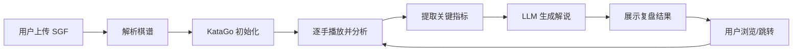

## 1. 产品概述

围棋复盘 Agent 是一款结合 KataGo 围棋引擎和大语言模型的智能复盘工具，帮助围棋爱好者用通俗易懂的语言理解棋局。

- 核心功能：SGF 棋谱上传、KataGo 引擎分析、AI 大白话解说
- 目标用户：围棋初学者、业余棋手、围棋教学工作者
- 产品价值：降低围棋学习门槛，让专业分析变得通俗易懂

## 2. 核心功能

### 2.1 用户角色
| 角色 | 注册方式 | 核心权限 |
|------|---------|---------|
| 普通用户 | 无需注册 | 上传棋谱、查看复盘、保存结果 |

### 2.2 功能模块
1. **首页**：上传棋谱、示例棋谱、使用说明
2. **复盘页面**：棋盘显示、落子历史、AI 解说面板
3. **设置页面**：KataGo 配置、LLM 配置、分析参数

### 2.3 页面详情
| 页面名称 | 模块名称 | 功能描述 |
|---------|---------|---------|
| 首页 | 上传区域 | 拖拽上传 SGF 文件，支持本地文件选择 |
| 首页 | 示例棋谱 | 预置经典棋局，一键加载复盘 |
| 复盘页面 | 棋盘展示 | 19路交互式棋盘，支持落子导航 |
| 复盘页面 | AI 解说 | 每步棋的大白话解说，胜率变化图表 |
| 复盘页面 | KataGo 分析 | 显示推荐变化、胜率、目差 |
| 设置页面 | 引擎配置 | KataGo 路径、权重文件、思考时间 |
| 设置页面 | LLM 配置 | API Key、模型选择、提示词调整 |

## 3. 核心流程

用户上传 SGF 棋谱 → 系统解析棋谱 → KataGo 逐手分析 → LLM 生成解说 → 用户浏览复盘结果

## 4. 用户界面设计

### 4.1 设计风格
- 主色调：深木色（#5D4037）+ 棋盘黄（#FFF8E1）+ 墨黑（#212121）
- 配色灵感：传统围棋棋盘的木质纹理
- 按钮风格：圆润边角，微阴影，木质纹理背景
- 字体：思源宋体（标题）+ 思源黑体（正文）
- 布局：左侧棋盘主区域，右侧解说面板，顶部导航
- 图标风格：线条简约，围棋元素（棋子、棋盘）

### 4.2 页面设计概述
| 页面名称 | 模块名称 | UI 元素 |
|---------|---------|---------|
| 首页 | 上传区域 | 大尺寸上传框，木纹背景，棋子图标动画 |
| 复盘页面 | 棋盘 | 真实木纹棋盘，3D 棋子效果，悬停高亮 |
| 复盘页面 | 解说面板 | 卡片式布局，时间线展示每手解说 |
| 复盘页面 | 分析图表 | 平滑胜率曲线，胜负区域高亮 |

### 4.3 响应式
- 桌面端：左棋盘右解说，双栏布局
- 平板端：上下布局，棋盘在上解说在下
- 移动端：棋盘自适应屏幕宽度，解说可折叠

### 4.4 动画效果
- 落子动画：棋子落下时轻微弹跳效果
- 页面切换：淡入淡出过渡
- 解说生成：打字机效果逐字显示
- 胜率图表：平滑曲线绘制动画