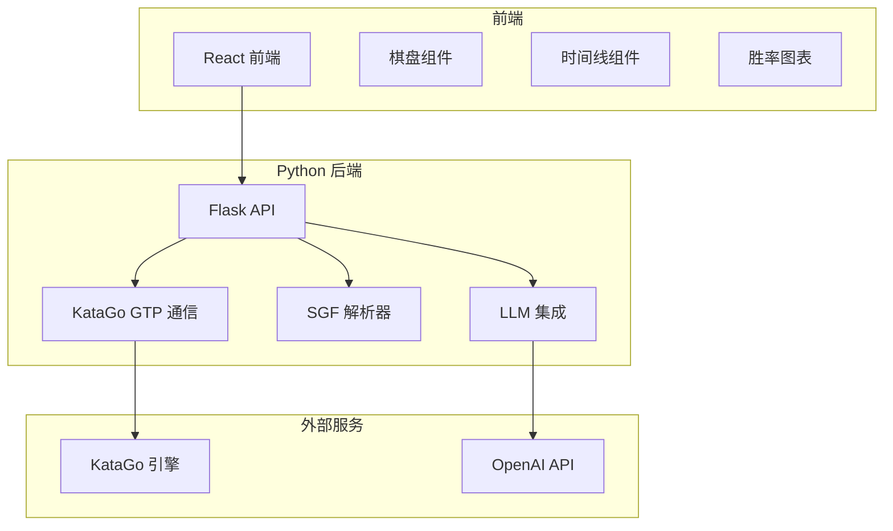
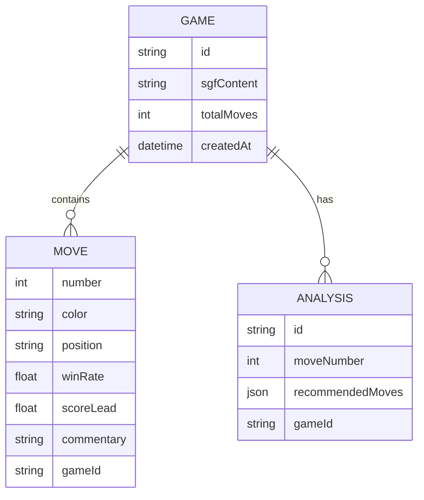

## 1. 架构设计



## 2. 技术选型

- 前端：React@18 + TypeScript + Vite + TailwindCSS
- 后端：Python 3.11 + Flask
- 棋盘渲染：React + Canvas 或 SVG
- 图表：Recharts
- 状态管理：Zustand
- KataGo 通信：subprocess + GTP 协议
- LLM：OpenAI API + 流式输出

## 3. 项目结构

```
go-reviewer/
├── frontend/
│   ├── src/
│   │   ├── components/
│   │   │   ├── GoBoard.tsx
│   │   │   ├── MoveTimeline.tsx
│   │   │   ├── WinRateChart.tsx
│   │   │   └── CommentaryPanel.tsx
│   │   ├── pages/
│   │   │   ├── Home.tsx
│   │   │   ├── Review.tsx
│   │   │   └── Settings.tsx
│   │   └── store/
│   └── package.json
├── backend/
│   ├── app.py
│   ├── katago_gtp.py
│   ├── sgf_parser.py
│   ├── llm_client.py
│   └── requirements.txt
└── .trae/documents/
```

## 4. API 定义

### 4.1 上传 SGF
```typescript
POST /api/upload
Request: FormData { file: File }
Response: {
  gameId: string,
  moves: Array<{
    number: number,
    color: 'B' | 'W',
    position: string
  }>
}
```

### 4.2 获取分析结果
```typescript
GET /api/analyze/:gameId
Response: {
  moveNumber: number,
  winRate: number,
  scoreLead: number,
  recommendedMoves: Array<{
    position: string,
    winRate: number,
    visits: number
  }>,
  commentary: string
}
```

### 4.3 配置 KataGo
```typescript
POST /api/config/katago
Request: {
  path: string,
  configPath: string,
  modelPath: string,
  analyzeTime: number
}
```

### 4.4 配置 LLM
```typescript
POST /api/config/llm
Request: {
  apiKey: string,
  model: string,
  baseUrl?: string
}
```

## 5. 数据模型



## 6. 核心技术实现

### 6.1 KataGo GTP 通信
- 使用 Python subprocess 启动 KataGo
- 实现标准 GTP 协议命令：play, genmove, kata-analyze
- 异步处理 stdout/stderr 避免阻塞

### 6.2 SGF 解析
- 使用 sgf 库解析棋谱
- 支持标准 SGF 属性：B, W, AB, AW, C
- 坐标转换：SGF 坐标 ↔ KataGo 坐标 ↔ 棋盘坐标

### 6.3 LLM 解说生成
- 提示词工程：围棋老师角色
- 输入：当前局面、胜率变化、推荐走法
- 输出：大白话解说，分点说明
- 流式输出提升用户体验

### 6.4 棋盘渲染
- 19x19 网格 SVG 渲染
- 棋子放置与动画
- 标记：最后一手、推荐变化、当前选中
- 支持鼠标悬停预览