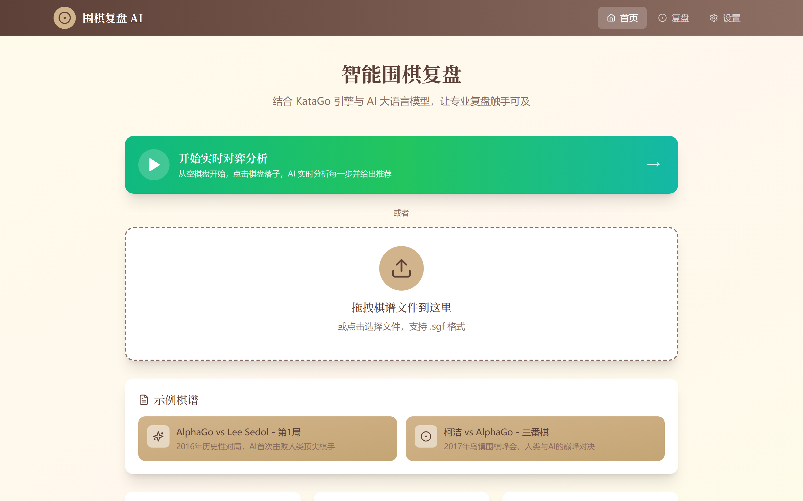
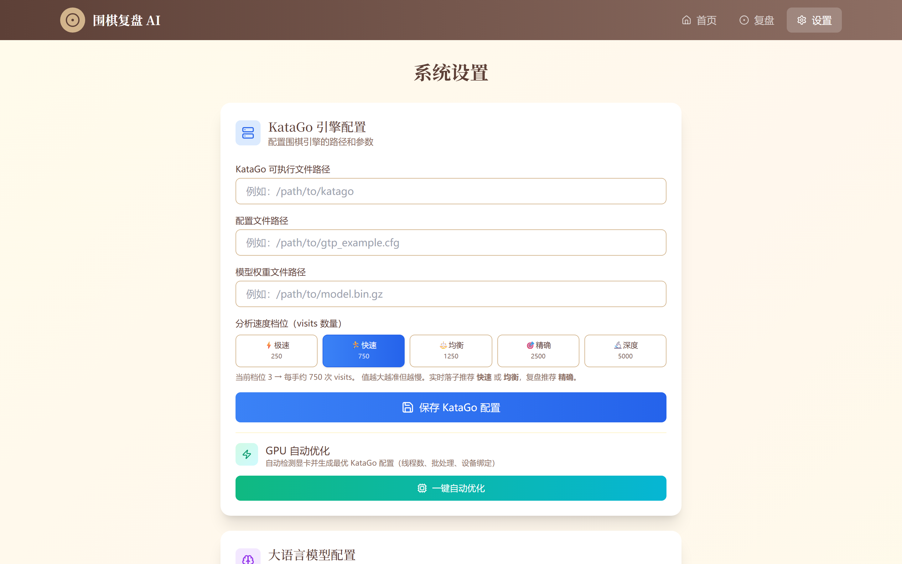

# 围棋复盘 AI · Go-Reviewer

**Go-Reviewer** 是一款结合 KataGo 围棋引擎与大语言模型的智能复盘桌面应用，让专业围棋复盘触手可及。支持在浏览器中使用，也可打包为跨平台桌面应用（Windows / macOS / Linux）。

<div align="center">
  
  
</div>

## 功能特性

- 🎯 **KataGo 引擎分析** — 最强开源围棋引擎，精准计算胜率和目差
- 🧠 **AI 智能解说** — 大语言模型将专业分析转化为通俗易懂的讲解
- 📈 **胜率曲线可视化** — 直观展示棋局走势
- 🎨 **精美棋盘界面** — 传统木纹风格，支持落子导航
- 📝 **落子历史时间线** — 快速跳转回顾任意手数
- 🚀 **实时对弈** — 在线模式支持与 KataGo AI 实时对弈
- 🖥️ **跨平台桌面应用** — 可选 Tauri 桌面封装，双击即用
- ⚡ **GPU 自动调优** — 自动检测显卡并生成最优分析参数

## 技术栈

| 层级         | 技术                                        | 用途                        |
| ------------ | ------------------------------------------- | --------------------------- |
| **前端**     | React 18 + TypeScript + Vite + Tailwind CSS | 棋盘 UI 与交互              |
| **后端**     | Python + Flask                              | REST API 与 KataGo 桥接     |
| **引擎**     | KataGo (OpenCL + Analysis Engine)           | 围棋 AI 计算                |
| **AI 解说**  | OpenAI API（兼容协议）                      | 自然语言复盘讲解            |
| **图表**     | Recharts                                    | 胜率曲线可视化              |
| **状态管理** | Zustand                                     | 前端状态管理                |
| **桌面封装** | Tauri 2 + Rust                              | 跨平台桌面应用壳            |
| **GPU 调优** | 内置 gpu_optimizer                          | 自动检测 GPU 并生成最优配置 |

## 快速开始

### 🖥️ 桌面版（推荐 / 开箱即用）

```bash
# 1. 安装 Rust 工具链
# 访问 https://rustup.rs/ 或 winget install Rustlang.Rustup

# 2. 安装 Python 依赖 + PyInstaller
cd backend
pip install -r requirements.txt
pip install pyinstaller

# 3. 安装前端依赖
cd ..
npm install

# 4. 构建并启动桌面应用
npm run tauri:dev
```

> **注意**: Windows 需要安装 Visual Studio Build Tools（C++ 工作负载）。
> 详细打包指南见 [DESKTOP_BUILD.md](DESKTOP_BUILD.md)。

### 🌐 Web 版（开发模式）

#### 前置准备

1. **下载 KataGo**
   - 从 [KataGo GitHub Releases](https://github.com/lightvector/KataGo/releases) 下载最新版本
   - 下载对应的权重文件（推荐 b18c384nbt 系列）
   - 解压后获取 `katago` 可执行文件、配置文件和权重文件

2. **获取 OpenAI API Key**（可选，用于 AI 解说）
   - 访问 [OpenAI Platform](https://platform.openai.com/api-keys) 获取 API Key

#### 安装依赖

```bash
# 前端
npm install

# 后端
cd backend
pip install -r requirements.txt
```

#### 启动服务

**终端 1 — 后端：**

```bash
cd backend
python app.py
# → http://localhost:5000
```

**终端 2 — 前端：**

```bash
cd go-reviewer
npm run dev
# → http://localhost:5173
```

### 配置系统

1. 打开浏览器访问 `http://localhost:5173`
2. 点击导航栏的「设置」
3. 填写 KataGo 相关配置：
   - KataGo 可执行文件路径
   - 配置文件路径（推荐 `analysis_fast.cfg`）
   - 模型权重文件路径
   - 分析时间（建议 3-5 秒，对应 750-1250 visits/手）
4. 填写大语言模型配置（可选）：
   - API Key
   - 模型名称（如 gpt-4, deepseek-chat）
5. 点击「**GPU 自动优化**」一键适配当前显卡

### 开始复盘

1. 点击首页的上传区域，上传 `.sgf` 格式的棋谱文件
2. 进入复盘页面后，使用导航按钮浏览棋局
3. 点击「KataGo 分析」获取当前局面的胜率和推荐走法
4. 点击「生成 AI 解说」获取通俗易懂的讲解

## 项目结构

```
📦 go-reviewer
├── 📂 src/                    # React 前端
│   ├── 📂 components/         # 棋盘, 导航栏等组件
│   ├── 📂 pages/              # 首页, 复盘, 设置等页面
│   ├── 📂 lib/                # API 工具, 围棋规则
│   └── 📂 store/              # Zustand 状态管理
├── 📂 backend/                # Python Flask 后端
│   ├── 📄 app.py              # Flask 主服务 + REST API
│   ├── 📄 katago_analysis.py  # KataGo Analysis Engine 封装
│   ├── 📄 katago_gtp.py       # KataGo GTP 协议封装
│   ├── 📄 gpu_optimizer.py    # GPU 自动检测与配置生成
│   ├── 📄 llm_client.py       # 大语言模型客户端
│   ├── 📄 sgf_parser.py       # SGF 文件解析
│   ├── 📄 build_backend.py    # PyInstaller 打包脚本
│   └── 📄 go-reviewer-backend.spec
├── 📂 src-tauri/              # Tauri 桌面应用壳
│   ├── 📄 tauri.conf.json     # 桌面应用配置
│   ├── 📂 src/
│   │   ├── 📄 main.rs         # Rust 入口
│   │   └── 📄 lib.rs          # 桌面主逻辑 (sidecar 启动 + 端口管理)
│   ├── 📂 capabilities/       # Tauri 权限配置
│   └── 📂 icons/              # 应用图标
├── 📂 scripts/                # 工具脚本
│   ├── 📄 dev-tauri.ps1       # Windows MSVC 环境加载
│   └── 📄 take_screenshots.py # Playwright 截图
├── 📂 screenshots/            # 应用截图
├── 📄 package.json
├── 📄 vite.config.ts
├── 📄 DESKTOP_BUILD.md        # 桌面打包指南
└── 📄 README.md
```

## API 接口

### 上传棋谱

```
POST /api/upload
Content-Type: multipart/form-data
Response: { gameId, moves, boardSize, ... }
```

### 分析局面

```
GET /api/analyze/:gameId/:moveNumber
Response: { winRate, scoreLead, recommendedMoves }
```

### 生成解说

```
GET /api/commentary/stream/:gameId/:moveNumber
Content-Type: text/event-stream
```

### 配置接口

```
POST /api/config/katago   # 配置 KataGo
POST /api/config/llm      # 配置 LLM
```

## 常见问题

### Q: KataGo 分析失败怎么办？

A: 检查以下几点：

1. KataGo 路径配置是否正确
2. 权重文件路径是否正确
3. KataGo 是否有执行权限
4. 后端服务是否正常运行

### Q: AI 解说生成失败怎么办？

A: 检查以下几点：

1. API Key 是否正确
2. 网络连接是否正常
3. API 配额是否充足
4. 模型名称是否正确

### Q: 支持哪些棋谱格式？

A: 目前仅支持 `.sgf` 格式的棋谱文件。

## 开发说明

### 前端开发

- 使用 Zustand 进行状态管理
- 组件遵循单一职责原则
- 使用 Tailwind CSS 进行样式开发

### 后端开发

- Flask 提供 RESTful API
- GTP 协议与 KataGo 通信
- SSE (Server-Sent Events) 实现流式解说生成

## License

MIT
